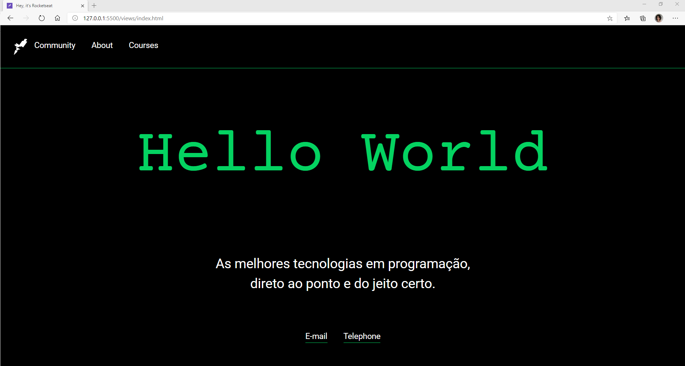

    
    <h1>Pequenos Passos</h1>

<h2> Esse repositório é constituido de desafios feitos ao longo dos módulos para prática do que foi passado nas aulas e assim construir um conhecimento mais concretizado afim de que os alunos estejam preparados para os Grandes Passos do curso que vai do básico de programação com Javascript até o desenvolvimento FullStack de uma aplicação Web com Node.js</h2>

---
## Desafio_2
É uma aplicação desenvolvida com base nas aulas e desafios passados durante o segundo módulo 'Iniciando o Front-end'.
É um projeto simples visando a apresentação da Rocketseat, seus curso e conteúdo.

    <h3>Home</h3>
    
    <h3>About</h3>
    
    <h3>Courses</h3>
    
    <h3>Gif</h3>
    

---
[@Rocketseat](https://github.com/Rocketseat)
[@maykbrito](https://github.com/maykbrito)

#### [Meu Linkedlin](https://www.linkedin.com/in/maria-raquel-3b27531a5/)